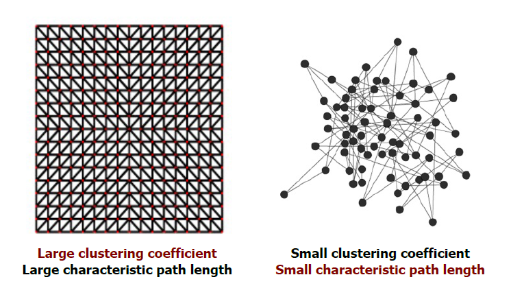
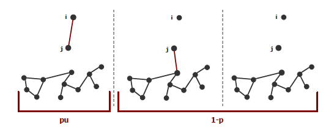

# Lecture material for part of the lecture 
# Network Dynamics & Complex Systems - Theoretical and Computational Tools 
(under construction)

Lecture content covered by me and provided here:
- Approximation theory (asymptotic solutions for ODEs, matched asymptotics) (9.11.2016)
- [Random networks](https://gitlab.com/di.ma/lecture-network-dynamics-and-complex-systems/-/blob/master/Lecture_16-11-16.pdf) (16.11.2016)  

- [Searching in complex networks](https://gitlab.com/di.ma/lecture-network-dynamics-and-complex-systems/-/blob/master/Lecture_23-11-16.pdf) (23.11.2016) 
- Random walks on graphs (14.12.2016)

Lecture took place during winter semester 2016/17 at Georg-August-Universität Göttingen

( Contect provided here was created by Dimitra Maoutsa. )

